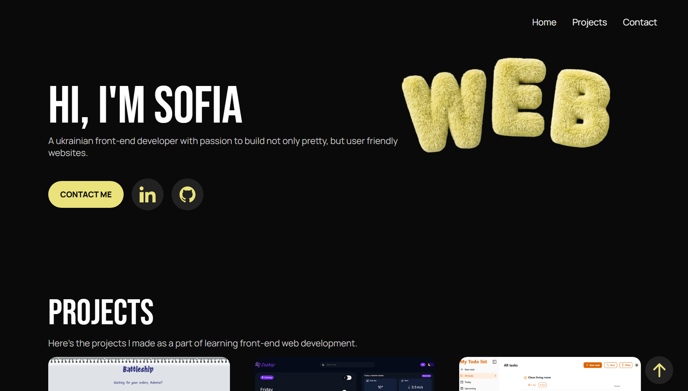
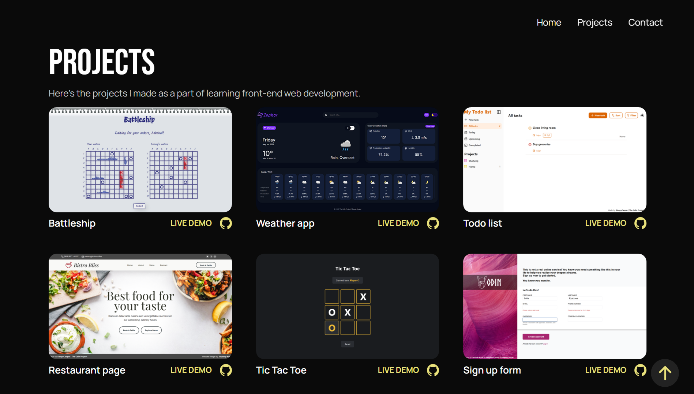

# 💼 Portfolio homepage
 
A personal portfolio website built as the project of [The Odin Project](https://www.theodinproject.com/) curriculum — a hand-coded, framework-free site showcasing my front-end projects through interactive, animated project cards.
 
## Preview
 
### [Live demo](https://sleepycasper.github.io/odin-homepage/)
 


 
## Features
 
- **Interactive project cards** — hovering or focusing on a card reveals an animated overlay with the tools used and a short project description
- **Keyboard and screen reader accessibility** — every interactive element is focusable with keyboard and the webpage is screen reader friendly
- **Sticky, auto-hiding header** — hides on scroll down, reappears on scroll up
- **Working contact form** — powered by [Formspree](https://formspree.io/), no backend required
- **Responsive design** — adapts across desktop, tablet, and mobile breakpoints
- **Back-to-top button** — smooth scroll with proper focus management for accessibility
## Key Challenges
 
- **Accessible animated overlays** — building hover/focus-triggered detail panels that support clean exit animations (via a `show`/`hide` class pattern with `animationend` listeners) while staying fully readable to screen readers
- **Accessibility auditing** — catching and fixing issues like duplicate accessible names, silent focusable elements, and missing `prefers-reduced-motion` support
- **Fluid, capped grid layout** — getting a responsive project grid to wrap naturally while enforcing a hard maximum column width
- **Cross-input event handling** — keeping mouse and keyboard interactions in sync using event delegation
## Built With
 
### Core Technologies
- HTML
- CSS (custom properties, keyframe animations, Grid & Flexbox)
- JavaScript (Vanilla, ES Modules)
### Third-Party Services
- [Formspree](https://formspree.io/) - contact form backend
### Development Tools
- [Webpack](https://webpack.js.org/) - module bundling for the browser
## Getting Started
 
### Prerequisites
 
- [Node.js](https://nodejs.org/) (includes npm)
### Installation
 
1. Clone the repository
```bash
   git clone git@github.com:SleepyCasper/odin-homepage.git
   cd odin-homepage
```
2. Install dependencies
```bash
   npm install
```
3. Start the development server
```bash
   npm start
```
4. Open your browser to `http://localhost:8080` (or whatever port Webpack Dev Server reports)
### Building for Production
 
```bash
npm run build
```
 
### Deploying to GitHub Pages
 
```bash
npm run deploy
```
 
## Project Structure
 
```
├── index.js              # App logic (scroll, header, card animations)
├── template.html         # Main page markup
├── styles/
│   ├── styles.css        # Base/global styles
│   ├── style-vars.css    # CSS custom properties (colors, fonts)
│   └── animation.css     # Keyframe animations
├── media/                # Images and icons
└── fonts/                # Self-hosted fonts
```
 
## License
 
This project is licensed under the [MIT License](LICENSE).
 
## Acknowledgments
 
- [The Odin Project](https://www.theodinproject.com/) for the curriculum and project brief
- Icons from [SVG repo](https://www.svgrepo.com/)
- Webpage layout is inspired by [Suman Kunwar's design](https://www.figma.com/community/file/1311309815091555685/portfolio-for-developers)
## Author
 
**SleepyCasper** — [GitHub](https://github.com/SleepyCasper)
 
---
Created as a part of [**The Odin Project**](https://www.theodinproject.com/) curriculum
